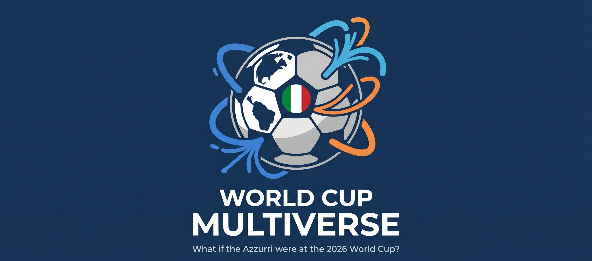
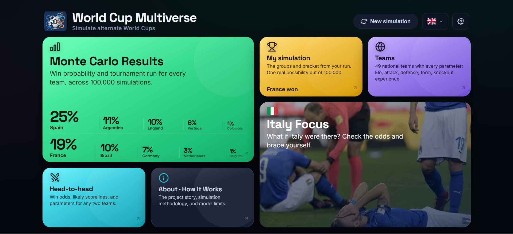
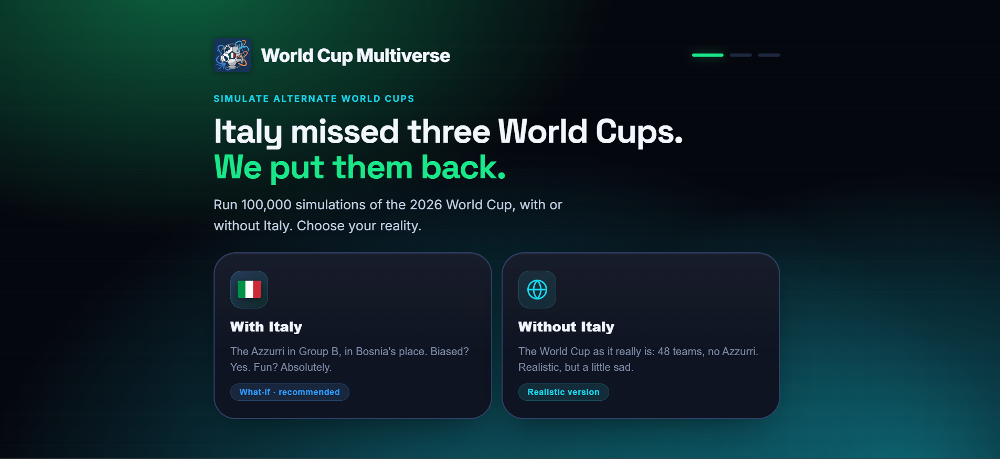
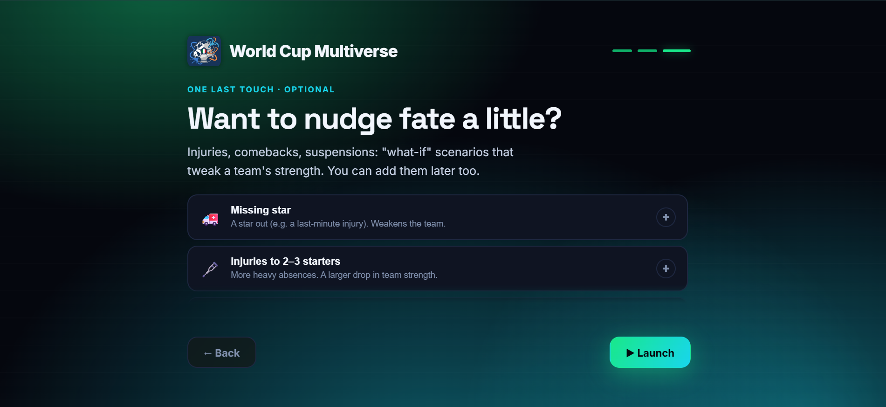
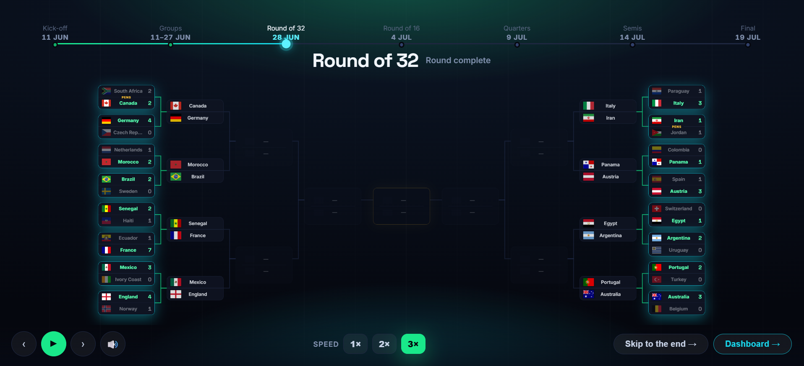
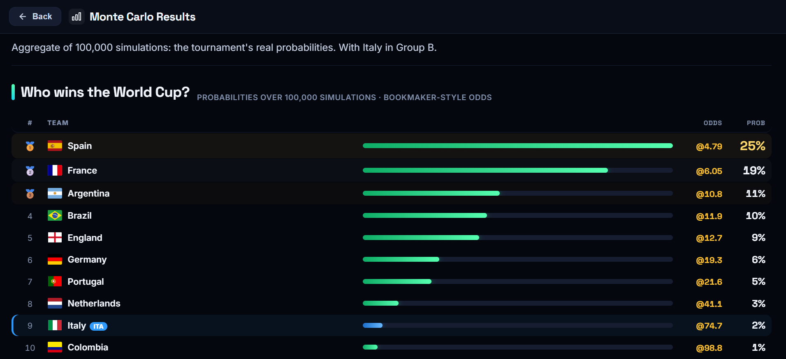
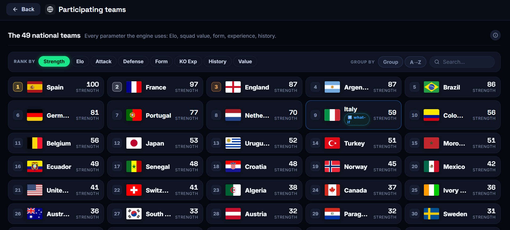
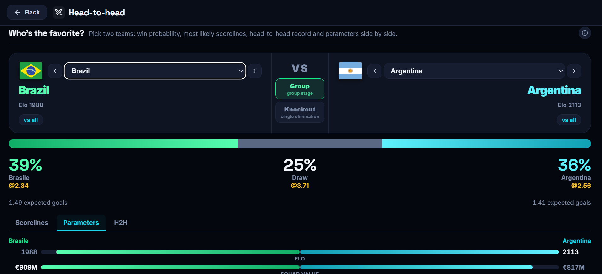

# ⚽ World Cup Multiverse: Force-Pushing Italy to the World Cup

<a name="readme-top"></a>

<div align="center">

  

  [](https://opensource.org/licenses/MIT)
  [](https://www.typescriptlang.org/)
  [](https://reactjs.org/)
  [](https://vitejs.dev/)
  [](https://world-cup-multiverse.vercel.app/)

  **Free, 100% client-side 2026 FIFA World Cup simulator powered by Monte Carlo & Bayesian statistics**

  [🌟 Overview](#-overview) •
  [🚀 Live Demo](#-live-demo) •
  [✨ Key Features](#-key-features) •
  [🔬 How It Works](#-how-it-works) •
  [🛠 Tech Stack & Architecture](#-tech-stack--architecture) •
  [💻 Getting Started](#-getting-started) •
  [📊 Data & Sources](#-data--sources) •
  [⚠️ Known Limitations](#️-known-limitations) •
  [👨‍💻 Author](#-author)

</div>

---

## Why does this exist? (a tiny therapy session)

On the night Italy got knocked out of the **third** World Cup in a row, I had two
options: process the grief like a functioning adult, or open a code editor at 2 AM.

Reader, I opened the code editor.

Other people journal. Some go to therapy. I built a **100,000-run Monte Carlo
simulator** of a parallel universe where the Azzurri are exactly where they
belong (at the World Cup) just to watch the numbers tell me they'd probably
lose in the Round of 32 anyway. Catharsis is a flag toggle now.

So this is, technically, a statistical-football engine. Emotionally, it's a
**digital coping mechanism with a Bayesian model attached**. There's a button
that puts Italy back into Group B in Bosnia's place. I press it a lot. It helps.

*"Italy isn't at the World Cup, so I put them back in myself."* (me, healing.)

> If you also need to grieve a footballing tragedy through excessive engineering,
> the simulator is live: **[world-cup-multiverse.vercel.app](https://world-cup-multiverse.vercel.app/)**.

---

## 🌟 Overview

**World Cup Multiverse** is a free, fully client-side interactive simulator of the **2026 FIFA World Cup** (48 teams). Hit *Simulate*, watch the animated bracket fill in live, and get each nation's win probability from a **Monte Carlo simulation of 100,000 runs**, all computed directly in your browser via a Web Worker, with no backend and no API.

### What Makes It Special?

- **Flagship What-If**: Italy didn't qualify (knocked out by Bosnia on penalties in the playoff). A toggle puts them back into **Group B** in Bosnia's place (the slot they'd have taken by qualifying) and re-runs every simulation. *"Italy isn't at the World Cup, so I put them back in myself."*
- **Honest Monte Carlo**: every run samples real match results and advances the *sampled* winner, never the favorite. `P(win) = wins / 100,000`. Repeated runs produce different winners.
- **Bayesian Engine Under the Hood**: per-team attack/defense estimated offline via a hierarchical **PyMC** model on ~49k historical matches, with Elo-anchored priors and time-decay.
- **Shareable What-If Scenarios**: stack heuristic modifiers (injuries, returns, suspensions, chaos) and share the exact scenario via a `?s=…` URL.

---

## 🚀 Live Demo

<div align="center">

### ▶️ The app is live and usable by anyone, no setup required

**[🌍 world-cup-multiverse.vercel.app](https://world-cup-multiverse.vercel.app/)**

Open the link, hit **Simulate**, and explore 100,000 possible World Cups in seconds.

</div>

---

## 📸 Screenshots

### Home Dashboard: every feature one click away
<div align="center">
  
</div>

### Onboarding: Italy IN or OUT?
<div align="center">
  
</div>

### Pre-Simulation: Configure your scenario
<div align="center">
  
</div>

### Tournament Cinema: Watch the bracket live
<div align="center">
  
</div>

### Monte Carlo Dashboard: Win probabilities
<div align="center">
  
</div>

### Teams: 48 squads with Strength Score
<div align="center">
  
</div>

### Head-to-Head Matchup
<div align="center">
  
</div>

---

## ✨ Key Features

### 🎬 Animated Tournament Cinema
Watch one full possible World Cup play out bracket by bracket in a cinematic animation: group stages, Round of 32, all the way to the final. Clearly labelled as "1 run out of 100,000."

### 📊 Monte Carlo Dashboard
- **Win probabilities** for all 48 teams, derived from the aggregate of 100,000 simulated tournaments.
- **Phase-by-phase reach table**: probability of reaching the Round of 32, QF, SF, Final, and winning.
- **Strength Score**: a synthetic 0–100 index per team combining Elo, squad value, form, KO experience, and H2H record.

### 🔀 What-If Scenarios
Stack playful heuristic modifiers on any team:
- ⭐ Missing star player
- 🤕 Injury crisis
- 🔙 Key player return
- 🟥 Suspension
- 🌀 Chaos factor

Modifiers adjust team ratings and instantly re-run the simulation. The URL encodes the full scenario for easy sharing.

### 🤝 Head-to-Head Matchup
Pick any two teams and get their direct probability breakdown (W/D/L), expected goals, and historical H2H record.

### 🌍 Multilingual UI
Full Italian and English support. Spanish and French dictionaries included but not yet exposed in the switcher (work in progress).

### ⚙️ Admin Tuning Panel
Simple and advanced panel to tweak modulator weights (form, squad value, Elo, KO experience, H2H) and observe the impact on probabilities in real time.

---

## 🔬 How It Works

### Match Engine

Each match is modelled as a **bivariate Poisson** (Dixon-Coles style):

```
λ_home = exp(intercept + attack_home − defense_away + homeAdv)
λ_away = exp(intercept + attack_away − defense_home)
```

The raw Poisson lambdas are then adjusted by:
- **Dixon-Coles low-score correction** (reduces overestimation of 0-0 and 1-0 scorelines).
- **H2H lambda nudge**: ±1–3pp based on direct head-to-head history (805 pairs pre-computed).
- **Modulators**: form, squad value, Elo, KO experience (weighted and configurable).
- **Lambda shrinkage**: keeps favorites from over-dominating in extreme cases.

### Monte Carlo Simulation

| Step | What happens |
|---|---|
| **Group stage** | 6 matches per group × 12 groups, sampled from the Poisson model. |
| **Best third-place teams** | 8 best third-placed teams selected and allocated to the R32 bracket using a deterministic allocator that respects FIFA's real constraints (no team faces its own group winner). |
| **Knockout rounds** | R32 → QF → SF → Final. Each match sampled; draws go to a penalty shootout coin-flip. |
| **Aggregation** | After 100,000 runs, `P(win) = wins / 100,000`. |
| **Animation** | A single sample run is retained for the cinema; it is explicitly separate from the aggregate statistics. |

### Bayesian Strength Parameters

Team attack and defense parameters are estimated **offline** (not at runtime) by a hierarchical Bayesian model (`model/fit.py`) using PyMC on ~49k international match results from 1872–2026, with:
- **Time-decay weighting** (recent matches count more).
- **Elo-anchored priors** (partial-pooling toward the global mean).
- **Exported as `model-params.json`**: the browser loads static JSON, with no Python and no fitting at runtime.

---

## 🛠 Tech Stack & Architecture

The project is split into two completely independent components: a **runtime** (browser) and an **offline pipeline** (Python, build-time only).

### Runtime: Browser, 100% Client-Side

```
TypeScript + React 18 + Vite
```

### Offline Pipeline: Python, Build-Time Only

```
PyMC · PyTensor · NumPy · pandas
```

### Repository Structure

```text
WorldCupMultiverse/
│
├── src/
│   ├── engine/                  # Pure TypeScript Monte Carlo engine (tested, no React)
│   │   ├── matchModel.ts            # λ, scoreline matrix, Dixon-Coles, H2H + modulators
│   │   ├── simulator.ts             # groups → best thirds → R32 → final, N-run aggregation
│   │   ├── bracket.ts               # official R32 structure + deterministic thirds allocator
│   │   ├── strengthScore.ts         # synthetic 0–100 Strength Score + factor breakdown
│   │   ├── rng.ts                   # seedable PRNG (mulberry32) for reproducibility
│   │   ├── types.ts                 # shared domain types
│   │   └── *.test.ts                # engine tests (Vitest)
│   │
│   ├── ui/                      # React UI
│   │   ├── App.tsx                  # orchestration: phases, Web Worker, animation
│   │   ├── simWorker.ts             # runs simulate() off the main thread
│   │   ├── useData.ts               # loads teams + model params + H2H + team-stats
│   │   ├── scenario.ts              # what-if → engine input; URL encode/decode (?s=)
│   │   ├── odds.ts                  # probability ↔ odds formatting
│   │   ├── bracketLayout.ts         # bracket geometry helpers
│   │   ├── cinemaAudio.ts           # Web Audio synthesis for the cinema
│   │   └── components/              # Standings, PhaseTable, RunDetail, TournamentCinema,
│   │                                # RevealCards, HomeCards, Onboarding, PreSim,
│   │                                # MatchupPage, TeamsPage, ItalyCard, AdminPage, ...
│   │
│   ├── i18n/                    # Client-side translations (it / en / es / fr)
│   ├── analytics.ts             # Vercel Analytics events
│   └── config.ts                # run count, fallback priors, what-if factors, modulator weights
│
├── public/data/
│   ├── teams.json               # 48 teams + inactive Italy (identity + covariates)
│   ├── model-params.json        # PIPELINE OUTPUT: per-team attack/defense + global params
│   ├── h2h.json                 # PIPELINE OUTPUT: 805 head-to-head pairs
│   └── team-stats.json          # PIPELINE OUTPUT: form, KO and history scores
│
└── model/                       # Offline Python pipeline (build-time, NOT in production)
    ├── fit.py                       # hierarchical Bayesian fit (PyMC) → model-params.json
    ├── build_h2h.py                 # head-to-head aggregation → h2h.json
    ├── build_team_stats.py          # form/knockout/history stats → team-stats.json
    ├── validate.py                  # RPS/Brier back-testing vs Elo baseline → validation.json
    ├── config.py                    # priors, hyperparameters, data window, paths
    ├── data.py                      # loads results.csv + teams.json, normalizes, time-decay
    └── README.md                    # how to regenerate the data
```

---

## 💻 Getting Started

### Running the App Locally

```bash
# 1. Clone the repository
git clone https://github.com/sPappalard/WorldCupMultiverse.git
cd WorldCupMultiverse

# 2. Install dependencies
npm install

# 3. Start the dev server
npm run dev        # → http://localhost:5173
```

Other useful commands:

```bash
npm run build      # production build → dist/
npm run typecheck  # tsc --noEmit
npm run lint       # eslint .
npx vitest run     # engine unit tests
```

The app works out-of-the-box with the pre-computed JSON files in `public/data/`. No Python setup needed to run or develop the frontend.

---

### Regenerating the Statistical Parameters (Optional)

The offline pipeline produces the JSON files consumed by the browser. Run it only if you want to retrain the Bayesian model on updated match data.

> **Prerequisites**: Python 3.11–3.13 (NOT 3.14, since PyMC wheels are not yet available), and `g++` on PATH for PyTensor compilation (on Windows, install MinGW-w64 via `winget install BrechtSanders.WinLibs.POSIX.UCRT` and add `mingw64\bin` to PATH).

```bash
cd model

# 1. Create a virtual environment
py -3.12 -m venv .venv
.venv\Scripts\python.exe -m pip install -r requirements.txt

# 2. Run the pipeline (order matters)
.venv\Scripts\python.exe fit.py              # → public/data/model-params.json
.venv\Scripts\python.exe build_h2h.py        # → public/data/h2h.json
.venv\Scripts\python.exe build_team_stats.py # → public/data/team-stats.json
.venv\Scripts\python.exe validate.py         # → public/data/validation.json
```

> Without `g++`, PyTensor runs in pure Python: correct but very slow. With MinGW it compiles a C extension and is orders of magnitude faster.

---

## 📊 Data & Sources

| Data | Source | Notes |
|---|---|---|
| **2026 group draw** | Wikipedia (official draw, 5 Dec 2025) | Bosnia in Group B |
| **Round of 32 structure** | Wikipedia "2026 FIFA World Cup knockout stage" | Matches 73–88 |
| **Elo ratings** | eloratings.net via Wikipedia | Snapshot **1 June 2026** |
| **Squad value** | Transfermarkt | Secondary covariate |
| **Historical match results** | Kaggle "International football results 1872–2026" | ~49,000 matches |
| **Head-to-head** | Pre-computed by `build_h2h.py` | 805 pairs, ±1–3pp lambda adjustment |

---

## ⚠️ Known Limitations

These are stated honestly in the UI as well.

- **What-if modifiers are heuristics**, not part of the predictive model. They are playful and clearly labelled as such.
- **Third-place allocation** uses a deterministic allocator that respects FIFA's real bracket constraints (no team faces its own group winner). It can differ from the exact Annex C table in rare combinations; the effect on aggregate probabilities is negligible. *(To validate.)*
- **Squad values** are sourced from Transfermarkt but are a secondary covariate with limited weight in the model.
- **Elo is a snapshot** (1 June 2026). The model does not auto-update.
- **`rho` (Dixon-Coles correlation)** is currently 0 in `model-params.json`; the config fallback uses −0.05.

---

## 👨‍💻 Author

**World Cup Multiverse** is designed and built by **sPappalard**.

<div align="center">

[](https://github.com/sPappalard)
[](https://www.linkedin.com/in/salvatore-pappalardo98/)
[](mailto:salvo.pappalardo.98.27@gmail.com)

</div>

---

## 📄 License

This project is released under the **MIT License**. Use it, fork it, build on it.

---

<div align="center">

**Built with ❤️ by [@sPappalard](https://github.com/sPappalard)**

<br>

[⬆ Back to Top](#readme-top)

</div>
